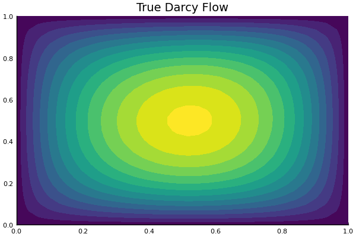
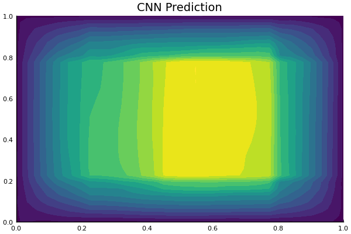
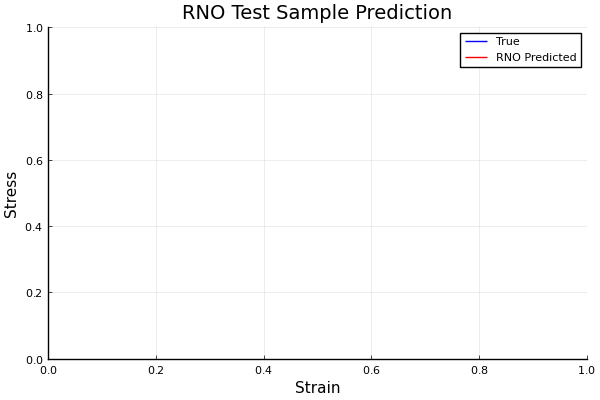

# Neural Operator Learning
This repository hosts two of my projects focused on operator learning for complex engineering systems. It includes implementations for learning solution operators for 2D Darcy flow problems and macroscopic constitutive models for composite materials. 

Models implemented:
- For the Darcy flow problem:
  - Convolutional Neural Network (CNN)
  - Fourier Neural Operator (FNO)
- For the viscoplastic unit cell problem:
  - Recurrent Neural Operator (RNO)
  - Transformer 

## 1. The 2D Darcy Flow Problem

  
  
  

The problem considers learning the solution operator of the 2D Darcy flow problem, which is governed by the following equation:

$$
-\nabla \cdot (a(x) \nabla u(x)) = f(x), \quad x \in (0,1)^2
$$

where:
- $a(x)$ is the diffusion coefficient generated from a random Fourier field
- $f(x)$ is a constant forcing function throughout the domain
- $u(x)$ is the solution field to be learned

The problem is subject to the Dirichlet boundary condition:

$$
u(x) = 0, \quad x \in \partial(0,1)^2
$$

The goal is to learn the operator mapping the diffusion coefficient \( a \) to the solution \( u \), denoted as:

$$
a \mapsto u
$$

using the Fourier Nueral Operator (FNO) presented in the paper: [Fourier Neural Operator for Parametric Partial Differential Equations](https://arxiv.org/abs/2010.08895). This is compared against a standard CNN as baseline.

## 2. Unit Cell Problem with Viscoelastic Constitutive Relation

  

Consider the following unit-cell problem governed by the equations:

**Kinematic relation:**

$$
\frac{\partial \epsilon(x,t)}{\partial x} = \frac{\partial u(x,t)}{\partial x}
$$

**Equilibrium:**

$$
\int_0^1 \frac{d\sigma(x)}{dx} = 0
$$

**Constitutive relation:**

$$
\sigma(x,t) = E(x)\epsilon(x,t) + v(x) \frac{\partial u(x,t)}{\partial t}
$$

Subject to the initial and boundary conditions:

**Initial conditions:**

$$
u(x,0) = 0, \quad \dot{u}(x,0) = 0
$$

**Boundary conditions:**

$$
u(0,t) = 0, \quad u(1,t) = \bar{u}(t)
$$

Where:
- $E(x)$ is Young's modulus
- $v(x)$ is viscosity
- $\epsilon(x,t)$ is the strain field
- $\sigma(x,t)$ is the stress field
- $u(x,t)$ is the displacement field

The problem considers a 3-phase composite material, where \( E(x) \) and \( v(x) \) are piecewise constant functions with 3 different values, as shown below:

The goal is to learn the macroscopic constitutive relation mapping the strain field \( \epsilon \) to the stress field \( \sigma \), denoted as:

$$
\epsilon \mapsto \sigma
$$

using the Recurrent Neural Operator (RNO) presented in the paper: [Neural Operator Learning for Long-Time Integration in Dynamical Systems with Recurrent Neural Networks](https://arxiv.org/abs/2303.02243). This is compared against the Transformer model as baseline.

